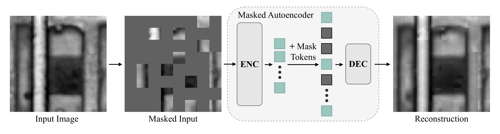

# Masked Autoencoder Self Pre-Training for Defect Detection in Microelectronics

This is a PyTorch implementation of Masked Autoencoders and Vision Transformers for our paper "Masked Autoencoder Self Pre-Training for Defect Detection in Microelectronics". 

## Overview

This repository contains the official implementation of our paper, which proposes a Masked Autoencoders (MAE) self pre-training approach to defect detection in microelectronics.



## Installation

All dependencies can be installed with the provided requirements file:

```bash
pip install -r requirements.txt
```

## Usage

### Configuration

Edit the hyperparameters in `Configs/config.yaml` to customize your training. Key parameters include:

```yaml
# Choose Dataset for Pre-Training: 
dataset: sam | imagenet

# Choose ViT size for Pre-Training and Fault Detection: 
vit_size: ti | s | b  # tiny, small, or base

# Use pre-trained encoder from pre-training: 
pretrained_model: path_to_model 

# Use baselines for Fault Detection
use_baseline: True | False 
baseline_model: sam_cnn | pcb_cnn | resnet50 | efficientnetb7 | vgg-11 

# GPU utils
device: cuda | cpu
num_workers: int 
batch_size: int 
```
Else, hyperparameters can be passed via command-line (see below).

### Pre-training with MAE

To run MAE pre-training for SAM images with a base-sized encoder, use:

```bash
python main.py only_pretrain=True vit_size=b dataset=sam
```

### Fault Detection (Supervised Training)

To run supervised fault detection training using a pre-trained ViT-B encoder:

```bash
python main.py vit_size=b dataset=sam pretrained_model=PATH_TO_MODEL
```

### Baseline Comparison

To run baseline models for comparison:

```bash
python main.py use_baseline=True baseline_model=sam_cnn
```

## Dataset

Our implementation supports two datasets:
- **SAM**: Scanning Acoustic Microscopy dataset for microelectronic defect detection (https://www.kaggle.com/datasets/andreaszippelius/hellastudy-of-leds2)
- **ImageNet**: Standard ImageNet dataset for pre-training

## Results

The table below shows our defect detection results. Our approach using ViT-B with self pre-training on SAM data outperforms:
- Supervised ViTs by 21.1%
- ViTs pre-trained on ImageNet by 10.2%
- The best convolutional baseline (VGG-11) by 5.3%

| Model | Method | Parameters | MSE ↓ | Δ to Best |
|-------|--------|------------|-------|-----------|
| SAM-CNN | supervised | 4.2M | 0.0336 | 10.5% |
| XRAY-CNN | supervised | 8.7M | 0.0337 | 10.9% |
| ResNet50 | supervised | 23.5M | 0.0339 | 11.5% |
| EfficientNet-B7 | supervised | 63.8M | 0.0331 | 8.9% |
| VGG-11 | supervised | 128.8M | 0.0320 | 5.3% |
| ViT-Ti | supervised | 5.7M | 0.0380 | 25.0% |
| ViT-S | supervised | 22.1M | 0.0368 | 21.1% |
| ViT-B | supervised | 86.7M | 0.0380 | 25.0% |
| ViT-Ti | MAE (ImageNet) | 5.7M | 0.0345 | 13.4% |
| ViT-S | MAE (ImageNet) | 22.1M | 0.0339 | 11.5% |
| ViT-B | MAE (ImageNet) | 86.7M | 0.0335 | 10.2% |
| ViT-Ti (ours) | MAE (self) | 5.7M | 0.0310 | 2.0% |
| ViT-S (ours) | MAE (self) | 22.1M | 0.0335 | 10.2% |
| **ViT-B (ours)** | **MAE (self)** | **86.7M** | **0.0304** | **-** |

## License

MIT

